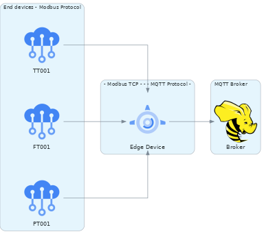

# IoT Edge Device

---

This program running in a Edge Device, allows an end device talking Modbus protocol  connect with any MQTT broker.

In IoT applications an Edge device is able to connect any industrial, comercial or home machine to the network, in this case it is connected to a central server locally or a cloud where the MQTT Broker resides.

