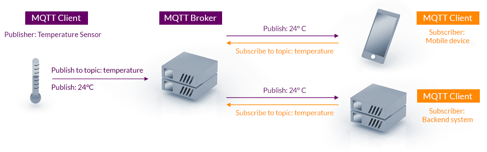

# IoT Monit

## Description

This is an Industrial Internet of Things (IIoT) project.

In the industry there is a lot of instruments and other devices that are used to monitor and control different processes. In the industry of food and beverage, for instance, could have tanks to storage liquids that needs to know the level of those tanks so they need to use a Level transmitter (LT) also this tanks usually have pipes and valves to allow pass the product to another container and they could need a Pressure Tranmitter (PT) and/or a Flow Transmitter (FT). All this variables are often monitor in local Human Machine Interface (HMI) which are screens in cabinets that are used by the operator to see these values. However, if a Manager needs to monitor this values or even needs a report to evaluate the productivity of any line of production the local HMI is not enough. This is one of the use of the project that I developed and show below.

The project is composed of two main parts. The first one is an application in C language which communicate with instruments and devices using Modbus TCP protocol (in the future the program can be programmed to support any other industrial protocol) then publish those data to a MQTT Broker. The second part of the project is a web server that allows to get access to data received from the instruments on the field.

With this project I learned fallowing things.

- Works with socket in C language.
- Integrate MQTT Library with my C code.
- Works with IEE 754 to convert integer data to float data.
- Save data to Sqlite from C language.
- Create an SSE service in Flask.
- Use envioroment variables in Flask.

## Edge device program

An edge is a device that is located the nearest possible to the instruments or end divices that needs to be monitored. In order to monitor these end devices they have to talk Modbus protocol.

### Modbus TCP protocol

In industrial automation, modbus procotol is one of the most famous and easy to configure industrial protocol, it is simple, powerfull and wide used by many manufacturer.
Modbus protocol works in client/server architecture and data is mapped into four different tables, two for 16-bits integer data and two for boolean data.

| Name                  | Data type       | Read/Write     | Address Range   |
| --------------------- | --------------- | -------------- | --------------- |
| Holding Register (4x) | Integer 16-bits | Read and Write | 400001 - 465536 |
| Input Register (3x)   | Integer 16-bits | Read only      | 300001 - 365536 |
| Output Coils (0x)     | Bit             | Read and Write | 1 - 65536       |
| Input Discrete (1x)   | Bit             | Read only      | 100001 - 165536 |

The map in a particular register address in modbus protocol is identified using the first number, so the Modbus address **400001** is the first register in the Holding Register map (4x), it is common to reference only to the offset so we can express this address as 0x0001 into the Holding register table.

Modbus Protocol defined a set of functions used to communicate with devices, below some of the most important.

| Function Code | Description                     | Supported |
| ------------- | ------------------------------- | --------- |
| 1             | Read Output Coils               | No        |
| 2             | Read Input Discrete             | No        |
| 3             | Read Holding registers          | Yes       |
| 4             | Read Input Registers            | Yes       |
| 5             | Write Single Coil               | No        |
| 6             | Write Single Holding Register   | No        |
| 15            | Write Multiple Coils            | No        |
| 16            | Write Multiple Holding Register | No        |

Since most of devices have their variables maps in Holding Registers the program was developed to fully support only function 3. In the future can be developed function 16 to write values in case of need any control and then the rest of the function to cover read/write all the possible Modbus tables.

In order to get data from those field devices that talk Modbus I developed a Modbus TCP server. The user can configure what variables can be read from the Modbus cliente using a configuration file called *config.conf*. Below an example of how the configuration file must be structured.

```
# Modbus Command
# cmd number, unit id, func code, offset address, count, poll interval (ms), ip address, port number
COMMANDS
#START
0 1 3 0 14 5000 192.168.3.169 502
#END

# Variables
#index variable, tag name, modbus address (byte), modbus map (4x, 3x, 1x, 0x), datatype, scalar (value / scalar), swap (0=No swap), mqtt topic, trigger threshold percentage
VARIABLES
#START
0 TT001 0 4 float 1 0 site1/TT001 10
1 PT001 4 4 float 1 0 site1/PT001 10
2 FT001 8 4 float 1 0 site1/FT001 10
3 LT001 12 4 float 1 0 site1/LT001 10
#END
```

This file has two parts, commands and variables. A command define the query that the Modbus server is going to execute in order to read data

| Parameter      | Description                                                                                                                                     | Range     |
| -------------- | ----------------------------------------------------------------------------------------------------------------------------------------------- | --------- |
| Unit ID        | Is the id number of the  client int the network                                                                                                 | 1 - 255   |
| Function Code  | Modbus Function to execute, this device only supports read functions 3 y 4                                                                      | 3, 4      |
| Offset Address | Is the first Modbus address, since we already have defined the map with the function code this parameter only represents the offset on that map | 0 - 65535 |
| Count          | Represent the number of register to read                                                                                                        | 1 - 125   |
| Poll Interval  | Minimum time interval (in miliseconds) to issue multiple commands                                                                               | 1 - 15000 |
| IP Address     | IP address of the Modbus CLient                                                                                                                 | -         |
| Port Number    | It is the TCP port used to established connection. Modbus TCP by default uses tcp port 502                                                      | 1 - 65536 |

To configure the variables the sofware needs the following parameters.

| Parameter         | Description                                                                                                                                                                                                                                                                                                                     | Range                                        |
| ----------------- | ------------------------------------------------------------------------------------------------------------------------------------------------------------------------------------------------------------------------------------------------------------------------------------------------------------------------------- | -------------------------------------------- |
| Tag Name          | It is the unique variable identifier                                                                                                                                                                                                                                                                                            | Text, prefered base on ANSI/ISA 5.1 standard |
| Modbus Address    | Modbus address that belongs to the modbus address range defined in commands                                                                                                                                                                                                                                                     | 0 - 65535                                    |
| Modbus Map        | Define Modbus table                                                                                                                                                                                                                                                                                                             | 0, 1, 3 or 4                                 |
| Data Type         | This allows to convert Bytes read in Float (using IEEE 754), Double Integer (32-bits), Integer (16-bits)                                                                                                                                                                                                                        | float, dint, int, udint, uint                |
| Scalar            | Number to scale the variable to obtain the value in engineering units, this value is used to divide the variable                                                                                                                                                                                                                | 1 - 65536                                    |
| Swap              | In order to meet big/little-endian defined in the end device we need to swap bytes or words. For now the software only supports 0 = No swap                                                                                                                                                                                     | 0 = No Swap                                  |
| MQTT Topic        | This is the topic where the value is going to be published. In order to identify properly all data published the topic should be structured with the name of site and the tag neme separated by a slash (site1/TT001)                                                                                                           | site-name/tag-name                           |
| Trigger Threshold | This is the variation of any float or integer value that trigger a publish event. The edge device is not going to publish any little variation of the variable, this will improve data usage since it will be limited in this kind of devices. See below an image that shows how data is publish by event using this parameter. | 1 - 100                                      |

The chart shows an orange curve that represents the modbus variable read and every red arrow shows when a value has reached/fallen the percentage indicates by the Trigger Threshold parameter.


After change any parameter in config file the software needs to be restarted to apply the changes.

The program also supports MQTT protocol to publish data to internet.

### MQTT Protocol

MQTT is a lightweight protocol which consists of a broker and multiple clients, it is based on publish/subscribe messaging architecture.


Image source: mqtt.org

For this project, I used the MQTT C library Paho from eclipse.dev. All the documentation can be found in their web site [Paho C Library](https://eclipse.dev/paho/files/mqttdoc/MQTTClient/html/index.html).

To compile the program properly it is necessary to download and install Openssl and Paho library following the steps below

```
******
Openssl
******
git clone https://github.com/openssl/openssl.git
cd openssl
sudo ./Configure
sudo make
sudo make test
cd ..

Alternatively, you can install Openssl using apt install:

sudo apt-get install fakeroot devscripts dh-make lsb-release
sudo apt-get install libssl-dev

******
Paho Mqtt
******
git clone https://github.com/eclipse/paho.mqtt.c.git
cd paho.mqtt.c
sudo make
sudo make install
cd ..

```

To establish connection with the broker you need to configure the broker hostname and credentials in the main program edge.c. All tests have been made using Hive MQ Broker.

```
const char *MQTT_BROKER_URI
const char *MQTT_CLIENT_ID
const char *USERNAME
const char *PASSWORD
const int MQTT_PORT
```

### SQL

The program also saves data in a local database so you can find the sqlite3 database file in the slite3 folder, also there is a sql file where I left the schema to create the tables that the program needs.

After configure the program properly you can compile it using *make* and you can simulate Modbus TCP server using the software Modsim or Modbus Poll in windows and [this C library](https://github.com/soso7885/modbus_simulator/tree/master) in linux, if the Modbus comunication is established the program will be able to publish values to MQTT broker.

Below an image that represents the topology of the project and the communication protocols that are used.


## Web app

*I am going to upload this part of the project in a different repo.*

This is the second part of the project and consists of a web server that subscribes to MQTT topics to receive any new values published, this web server is based on Flask.

### Files

The main program is called **app.py** also there is a **helpers.py** that contains a set of functions used in the app. You also can find a file called isrgrootx1.pem which is the SSL hey used by the MQTT connection to secure it. The file **project.db** is the database where historical data is saved and **project.sql** contains all the queries used to populate the database file with all needed tables. Finally, the file **.env-example** contains a template of the envioroment variables that the web app needs to works properly, it should be renamed to just **.env**.
The file **settings.py** contains all the variables to configure the MQTT connection using the sensitive values from the .env file.

### Main features

This server implements a Server-Sent Event (SSE) in order to push data received from MQTT to the HTTP client side, with this service, the client side is programmed in JavaScript to subscribe to a "topic" that is created in the server where data is updated on each event generated by the MQTT data received. This feature fits to this project since the main transport protocol of this application is MQTT and this works by events, another option is using Socket IO that allows server and client exchange data, this will be very usefull when we want to allow to control any end device on the field, for example, a valve or maybe a variable frequency drive (VFD) to control motors but this control feature is out of scope in this stage of the project, it can be implemented in the future.

Data is storage in an sqlite database to keep historical register.

In order to connect to the MQTT broker the file **.env** needs to be completed with the URL where the broker is hosted, the username and password, also change the SSL key file name if needed. For test purposses I used the broker Hive MQ which have a free tier which allows testing the project.

A new user must be registered and then login to get access to the dashboard where data is show.


## TODOs

- Make edge program works with most modbus function codes.
- Make Flask work with socket IO instead SSE in order to allow write commands to field devices.
- Create a table in edge database to storage data when the device is disconnected from the MQTT Broker and use it as a buffer to send it to the cloud whith its time stamping.
- Make the edge device wait for Modbus TCP server to connect, not close the program.
